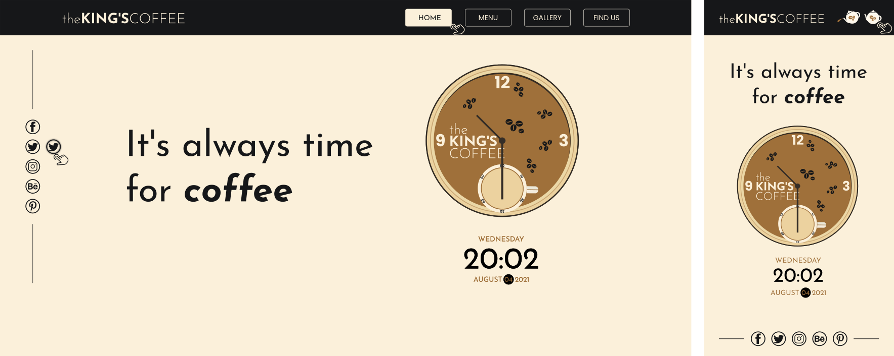
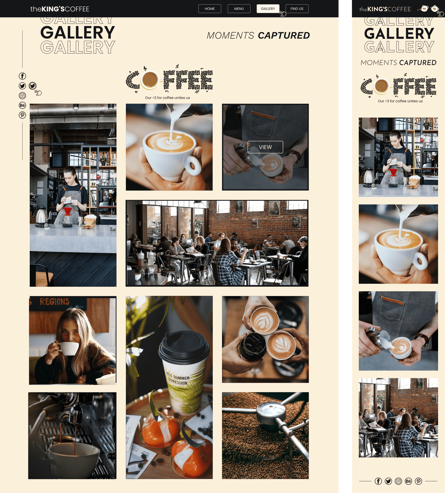
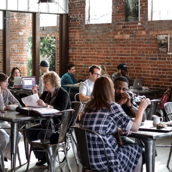

# The King's Coffee

This is a challenge I designed to help me practice my skills in **Frontend Web Development**.

## Table of contents

- [Overview](#overview)
  - [About the challenge](#about-the-challenge)
  - [Screenshots](#screenshots)
  - [Links](#links)
- [My process](#my-process)
  - [Built with](#built-with)
  - [What I learned](#what-i-learned)
  - [Continued development](#continued-development)
  - [Useful resources](#useful-resources)
- [Author](#author)

## Overview

### About the challenge

The challenge aims to test the developer's skill in:

- CSS Flexbox
- CSS Grid
- Responsive design
- JavaScript functionality

### Screenshots



Screenshot of the **Home** page design.

What's in view:

- It's shows the design of the site on both **Desktop** and **Mobile** devices including some partial hover states.

---



Screenshot of the **Gallery** page design.

What's in view:

- It's shows the design of the site on both **Desktop** and **Mobile** devices including some partial hover states.

---

### Links

- Live Site URL: [The King's Coffee](https://allankirui.github.io/the-kings-coffee)

## My process

- Originally, I had only designed the **Home**, **Menu** and **Gallery** pages. After I had started coding the designs, I made necessary changes along the way, such as designing and coding the **Find Us** page. The end result is the site as it is right now.

- I definitely took my time in building the project and most of that time I spent doing research on how I could implement all the different features that I wanted to implement such as the **clock** and the **sliding text** on the **Home** page, the **steaming coffee cup** on the **Menu** page etc.

### Built with

- HTML5
- CSS Grid
- CSS Flexbox
- SASS
- JavaScript
- Desktop-first workflow
- [Inkscape](https://inkscape.org) - Inkscape: Open Source Scalable Vector Graphics Editor

### What I learned

- Working on the project gave me the chance to practice my **Frontend skills** and to be better at:

  - making **responsive websites**
  - working with **source control**
  - working with **CSS Grid**
  - working with **SASS**

- I have a confession to make. I never knew that my browser held such power within it. A power that would have saved me a lot of headaches in the past :D. I can't stress enough how much **Google's** [Lighthouse](https://developers.google.com/web/tools/lighthouse) helped me make my pages follow **best practices**, meet **accessibility standards**, and have optimal **performance**.

- Being able to set mutliple images to show for different screen sizes using the `<picture>` element came quite handy when working on the **grid** design of the **Gallery** page.

```html
<picture>
  <source media="(min-width: 750px)" srcset="./img/gallery-img-4-desktop.png" />
  </picture>
```

- I just love watching the steam rise from that coffee cup :D

```scss
.coffee-cup {
  position: fixed;
  top: 80vh;
  right: 0;

  img {
    max-width: 80%;
  }

  .steam {
    position: absolute;
    top: -80%;
    left: 35%;

    img {
      opacity: 0;
      animation: steaming 3s linear infinite;
    }

    img:nth-child(1) {
      position: absolute;
      bottom: -10px;
      left: -15px;
      animation-delay: 1.8s;
    }

    img:nth-child(2) {
      animation-delay: 1s;
    }

    img:nth-child(3) {
      position: absolute;
      bottom: -8px;
      right: -7px;
      animation-delay: 1.3s;
    }
  }
}

@keyframes steaming {
  0% {
    transform: translateY(0);
    opacity: 0;
  }
  5% {
    opacity: 0;
  }
  50% {
    opacity: 1;
  }
  95% {
    opacity: 0;
  }
  100% {
    transform: translateY(-7vh);
    opacity: 0;
  }
}
```

- I also enjoyed harnessing the power of **JavaScript** to give the `<form>` in the **Find Us** page a **wave-like animation**.

```javascript
// Wave effect functionality on form labels
const labels = document.querySelectorAll(".form-control label");

// Loop through each label, adding a span with a specified transition delay to them
labels.forEach((label) => {
  label.innerHTML = label.innerText
    .split("")
    .map(
      (letter, index) =>
        `<span style="transition-delay:${index * 50}ms">${letter}</span>`
    )
    .join("");
});
```

### Continued development

- Going forward, I want to **practice** what I already know by tackling more **Frontend** projects, and applying the features and best practices that I've learnt from working on this project.

### Useful resources

- [Inkscape](https://inkscape.org) - Inkscape SVG Editor. I use it all the time when I'm working on any web project. After designing the project, I used **Inkscape's** in-built tools to help me figure out the **spacing**, **sizing** and **positioning** of elements throughout the project. To better understand how I approached coding the project using Inkscape, have a look at this repository I made - [Designing and Coding Layouts](https://github.com/AllanKirui/designing-and-coding-layouts)

- [SASS](https://sass-lang.com) - I can't imagine having coded the project without using a **CSS preprocessor**. **SASS** really made my workflow much smoother than it would have been otherwise.

- [tinyPNG](https://tinypng.com) - This site was particularly handy in compressing my images.

- [CSS Minifier](https://cssminifier.com) and [JS Minifier](https://javascript-minifier.com) - As the names suggest, these sites help reduce the size of your **CSS** and **JavaScript** files which in turn shaves off some valuable time of your site's load speed.

- [Lighthouse](https://developers.google.com/web/tools/lighthouse) - I used **Lighthouse** to run a number of test suites on the pages to help improve their quality.

## Author

- Github - [Allan Kirui](https://www.github.com/AllanKirui)
- Instagram - [@nallawilljr](https://www.instagram.com/nallawilljr)

[Back to top](#the-kings-coffee)
